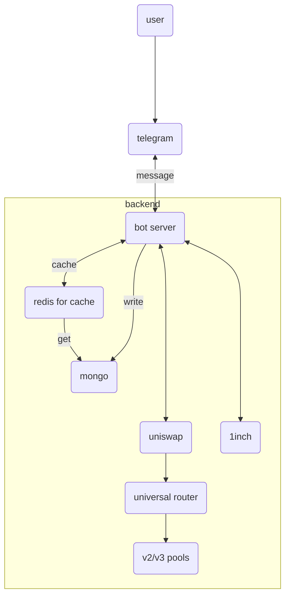

# telegram bot - Bun runtime

## Development

```bash
# To start the development server run:
bun run dev
```

Open http://localhost:3000/ with your browser to see the result.

## hightlevel design


