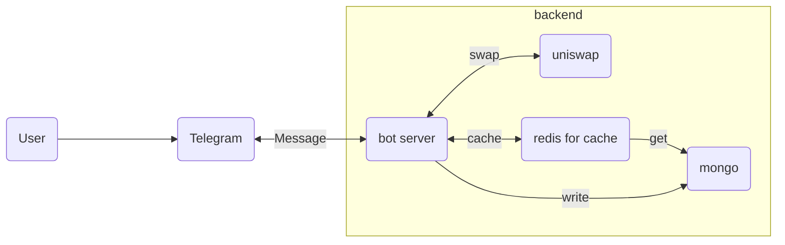

# Telegram Bot Trading

Welcome to my telegram bot trading.

## Hightlevel Design

## Video demo

### start and mamager wallet
- first you need create or import an wallet.
  
https://github.com/yushaku/telegram_bot/assets/72312124/8ccdf2ae-d605-4c42-b2cb-ef2174b68498

### Token Exchange
- swap token with uniswap pool
  
https://github.com/yushaku/telegram_bot/assets/72312124/6f87071d-d073-4548-a6a3-d27e5ed3cb35

### Tracking wallet

https://github.com/yushaku/telegram_bot/assets/72312124/27f6909d-e3ce-468c-982c-3bdc89b4b47e

